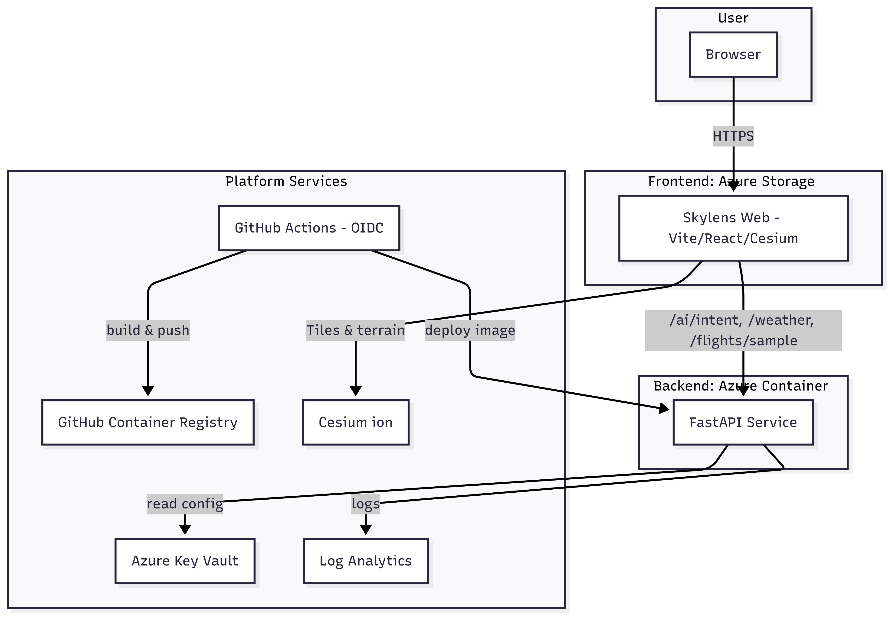

# Skylens: London Flight + Weather 3D
## Cesium Certified Developer Submission

**Live Demo:** https://stskylenslondev0532.z33.web.core.windows.net/

A comprehensive CesiumJS application demonstrating expert-level usage across multiple domains: time-dynamic flight visualization, advanced camera controls, 3D tiles styling, natural language interfaces, and weather integration.

Video link: https://docs.google.com/videos/d/1z_HIgJtO21Gb_D97eob4DEVc6JbJ7oIU6JDPWzh24xs/edit?usp=sharing
## 🎯 Cesium Expertise Demonstrated

### Core CesiumJS Features
- **3D Globe & Terrain**: Cesium ion integration with world terrain
- **Time-Dynamic Entities**: Flight tracks using `Entity` + `SampledPositionProperty`
- **Camera Control Mastery**: 5 demo modes (fly-to, orbit, follow, chase, free)
- **3D Tiles Styling**: OSM Buildings height-band visualization with `Cesium3DTileStyle`
- **Timeline Integration**: Smooth animation with `viewer.clock` controls
- **Performance Optimization**: Scoped rendering and proper event cleanup

### Advanced Implementation
- **Natural Language Commands**: Backend intent validation → frontend dispatcher → Cesium effects
- **Weather Integration**: METAR cards with aviation data
- **NOTAM Q&A**: Mini-RAG with vector search and citations
- **Production Architecture**: Full CI/CD deployment on Azure

## 🏗️ Architecture




**System Components:**
- **Frontend**: Vite + React + TypeScript + CesiumJS (Azure Static Website)
- **Backend**: FastAPI service (Azure Container Apps)
- **Data Sources**: Cesium ion, Aviation Weather APIs
- **Deployment**: GitHub Actions with OIDC security

## 🚀 Key Features

### 1. Time-Dynamic Flight Visualization
```typescript
// Entity with SampledPositionProperty for smooth animation
const entity = viewer.entities.add({
  position: sampledPosition,
  orientation: new VelocityOrientationProperty(sampledPosition),
  path: { material: Color.CYAN, width: 3 }
});
```

### 2. Advanced Camera Modes
- **Fly-to**: Smooth camera transitions with extended duration
- **Orbit**: Circular motion using `Camera.lookAt` + `onTick`
- **Follow**: Tracked entity with `viewer.trackedEntity`
- **Chase**: Custom positioning behind motion vector
- **Free**: Exit scripted behavior with proper cleanup

### 3. OSM Buildings Height Styling
```typescript
// Cesium3DTileStyle with height bands and guards
const style = new Cesium3DTileStyle({
  color: {
    conditions: [
      ['${height} >= 120', 'color("#8B0000")'],
      ['${height} >= 60', 'color("#FF4500")'],
      ['${height} >= 30', 'color("#FFD700")'],
      ['${height} >= 10', 'color("#32CD32")'],
      ['true', 'color("#87CEEB")']
    ]
  }
});
```

## 📁 Repository Structure

```
docs/
├── CESIUM_SUBMISSION.md     # Complete project narrative
├── architecture.md          # Technical documentation
├── architecture-diagram.png # System architecture visual
└── REVIEWER_GUIDE.md        # Quick verification steps

frontend/src/
├── components/
│   ├── CesiumViewer.tsx     # Core Cesium integration
│   ├── CameraControls.tsx   # Demo camera modes
│   └── LeftPanel.tsx        # UI controls and commands
└── lib/
    ├── intentDispatcher.ts  # Camera/layer effect mapping
    └── api.ts              # Backend API client

api/
├── main.py                 # FastAPI endpoints
├── config.py              # Configuration management
└── requirements.txt       # Python dependencies

screenshots/                # UI demonstration images
```

## 🎮 Quick Demo

1. **Load Application**: Globe renders with OSM Buildings and height legend
2. **Toggle Demo Mode**: Click "Demo" link (bottom-left) to access camera controls
3. **Camera Modes**: Try Fly to EGLL → Orbit → Follow Demo flight
4. **NOTAM Q&A**: Ask "runway closures at Heathrow" in left panel
5. **Commands**: Use quick actions or type "buildings off"
6. **Timeline**: Scrub to see flight animation

## 🔧 Technical Highlights

### CesiumJS API Usage
- **Entity System**: Time-dynamic flight tracks with interpolation
- **Camera APIs**: `flyTo`, `lookAt`, `trackedEntity` for smooth control
- **Styling**: `Cesium3DTileStyle` with conditional expressions
- **Events**: `Clock.onTick` for custom animations with cleanup
- **Performance**: Scoped tile rendering and memory management

### Production Features
- **Security**: No secrets in code, OIDC deployment
- **Performance**: Optimized rendering scope, cached responses
- **UX**: Slowed animations for demo clarity, accessible controls
- **Architecture**: Clean separation, proper error handling

## 🏆 Why This Demonstrates CesiumJS Expertise

1. **Advanced Entity Management**: Complex time-dynamic visualization
2. **Camera Control Mastery**: Multiple sophisticated modes with transitions
3. **3D Tiles Styling**: Semantic visualization with performance optimization
4. **Production Architecture**: Full deployment with security and monitoring
5. **Innovation**: Natural language interface and aviation data integration

## 📞 Reviewer Notes

- **Live Site**: Immediately accessible, no setup required
- **Demo Mode**: Toggle via bottom-left link for camera controls
- **Documentation**: Comprehensive technical details and verification steps
- **Code Quality**: TypeScript, proper cleanup, error handling
- **Performance**: Optimized for smooth demo experience

---

**Submission for Cesium Certified Developer Program**  
**Project**: Skylens London Flight Weather 3D  
**Developer**: Live  
**Date**: August 2025
